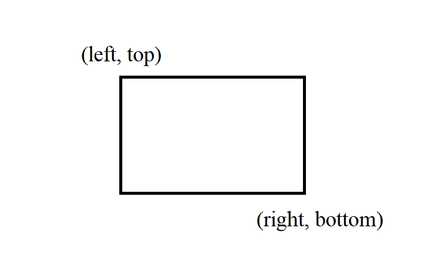

# Cirno

&emsp;&emsp;Cirno是一个用C++编写的、纯头文件实现且易读懂的数学库，用于图形学方面。提供四元数、空间向量、4x4方阵以及一些常用变换的实现。

&emsp;&emsp;这里是它的文档。

[TOC]

## 使用

### Getting start

#### 依赖项

&emsp;&emsp;暂无

#### 添加到项目中

&emsp;&emsp;目前只能使用一个头文件来include到你的项目中：

```c++
#include <cirno/cirno.hpp>
```

&emsp;&emsp;其余文件不应该单独被include，不然可能带来编译错误。目前而言，include这个文件并不会严重影响编译时间，且不会引入严重的命名污染。

&emsp;&emsp;接着，在命名空间"cirno"下，可以使用这个库的所有内容。下面的例子计算：

```c++
// ...
void do_something()
{
    cirno::Vector3 a(1.0f, 2.0f, 3.0f);
    cirno::Vector3 b(3.0f, 4.0f, 5.0f);
    cirno::Vector3 c = a.CrossMul(b);
}
```

&emsp;&emsp;更多内容可以参照后面对于各个类的文档。

### 预处理宏

#### _MATHLIB_USE_SSE

&emsp;&emsp;该宏指定打开SSE指令集：

```c++
#define  _MATHLIB_USE_SSE    1      // use SSE
#include <cirno/cirno.hpp>
```

&emsp;&emsp;这个宏只能在IA32/AMD6等支持SSE指令集的地方使用。

## rect.hpp

&emsp;&emsp;本文件提供一些简单的矩形，方便个别函数使用。

### namespace

```c++
namespace cirno
{
   // here
}
```

### struct RectF

&emsp;&emsp;该结构体描述一个矩形：



&emsp;&emsp;通常情况下，我们默认：而且。

#### 成员

```c++
struct RectF
{
    float32 left, right;
    float32 top, bottom;
};
```

#### 成员函数

##### RectF::RectF()

&emsp;&emsp;默认构造函数。

&emsp;&emsp;参数：无。

&emsp;&emsp;异常：无。

##### RectF::RectF(float32 l, float32 r, float32 t, float32 b)

&emsp;&emsp;构造一个矩形。该方法不检查参数的有效性。

&emsp;&emsp;参数：

| 参数类型 | 参数名称       | 说明             |
| -------- | -------------- | ---------------- |
| float32  | l              | 指定矩形的left   |
| float32  | r              | 指定矩形的right  |
| float32  | t指定矩形的top | 指定矩形的top    |
| float32  | b              | 指定矩形的bottom |

&emsp;&emsp;异常：无。

### struct RectI32

&emsp;&emsp;该结构体描述一个矩形，其中所有坐标均为32位有符号整数：


&emsp;&emsp;通常情况下，我们默认：而且。

#### 成员

```c++
struct RectI32
{
    int32_t left, right;
    int32_t top, bottom;
};
```

#### 成员函数

##### RectI32::RectI32()

&emsp;&emsp;默认构造函数。

&emsp;&emsp;参数：无。

&emsp;&emsp;异常：无。

##### RectI32::RectI32(int32_t l, int32_t r, int32_t t, int32_t b)

&emsp;&emsp;构造一个矩形。该方法不检查参数的有效性。

&emsp;&emsp;参数：

| 参数类型 | 参数名称       | 说明             |
| -------- | -------------- | ---------------- |
| int32_t  | l              | 指定矩形的left   |
| int32_t  | r              | 指定矩形的right  |
| int32_t  | t指定矩形的top | 指定矩形的top    |
| int32_t  | b              | 指定矩形的bottom |

&emsp;&emsp;异常：无。

##### RectI32::operator RectF()

&emsp;&emsp;将该结构转换为RectF结构。可能会有一定的精度损失。

&emsp;&emsp;参数：无。

&emsp;&emsp;异常：无。

## vector2.hpp

&emsp;&emsp;本文件提供平面向量。

### namespace

```c++
namespace cirno
{
   // here
}
```


## vector3.hpp

&emsp;&emsp;本文件提供空间向量。

### namespace

```c++
namespace cirno
{
   // here
}
```


## vector4.hpp

&emsp;&emsp;本文件提供四维向量。

### namespace

```c++
namespace cirno
{
   // here
}
```


## quater.hpp

&emsp;&emsp;本文件提供四元数。

### namespace

```c++
namespace cirno
{
   // here
}
```


## matrix4.hpp

&emsp;&emsp;本文件提供4x4大小的方阵，和一些生成该大小矩阵的方法。

### namespace

```c++
namespace cirno
{
   // here
}
```

