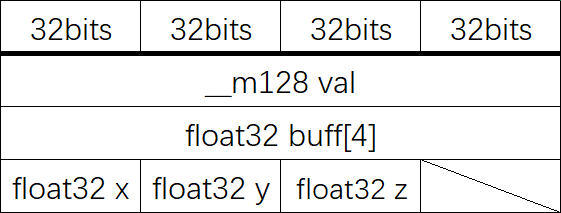
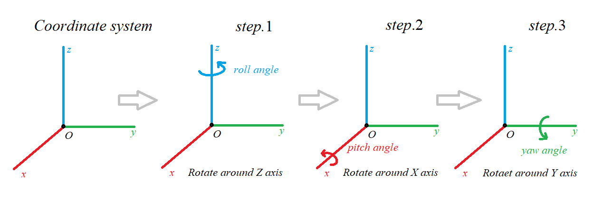
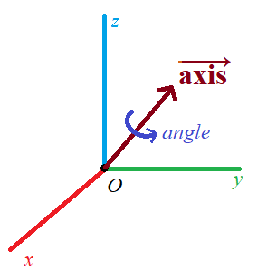

# Cirno

&emsp;&emsp;Cirno是一个用C++编写的、纯头文件实现且易读懂的数学库，用于图形学方面。提供四元数、空间向量、4x4方阵以及一些常用变换的实现。

&emsp;&emsp;这里是它的文档。

[TOC]

## 使用

### Getting start

#### 依赖项

&emsp;&emsp;暂无

#### 添加到项目中

&emsp;&emsp;目前只能使用一个头文件来include到你的项目中：

```c++
#include <cirno/cirno.hpp>
```

&emsp;&emsp;其余文件不应该单独被include，不然可能带来编译错误。目前而言，include这个文件并不会严重影响编译时间，且不会引入严重的命名污染。

&emsp;&emsp;接着，在命名空间"cirno"下，可以使用这个库的所有内容。下面的例子计算：

```c++
// ...
void do_something()
{
    cirno::Vector3 a(1.0f, 2.0f, 3.0f);
    cirno::Vector3 b(3.0f, 4.0f, 5.0f);
    cirno::Vector3 c = a.CrossMul(b);
}
```

&emsp;&emsp;更多内容可以参照后面对于各个类的文档。

### 预处理宏

#### \_MATHLIB\_USE\_SSE

&emsp;&emsp;该宏指定打开SSE指令集：

```c++
#define  _MATHLIB_USE_SSE    1      // use SSE
#include <cirno/cirno.hpp>
```

&emsp;&emsp;这个宏只能在IA32/AMD6等支持SSE指令集的地方使用。

## rect.hpp

&emsp;&emsp;本文件提供一些简单的矩形，方便个别函数使用。

### namespace

```c++
namespace cirno
{
   // here
}
```

### struct RectF

&emsp;&emsp;该结构体描述一个矩形：


&emsp;&emsp;通常情况下，我们默认：而且。

#### 成员

```c++
struct RectF
{
    float32 left, right;
    float32 top, bottom;
};
```

#### 成员函数

##### RectF::RectF()

&emsp;&emsp;默认构造函数。

&emsp;&emsp;参数：无。

&emsp;&emsp;异常：无。

##### RectF::RectF(float32 l, float32 r, float32 t, float32 b)

&emsp;&emsp;构造一个矩形。该方法不检查参数的有效性。

&emsp;&emsp;参数：

| 参数类型 | 参数名称 | 说明             |
| -------- | -------- | ---------------- |
| float32  | l        | 指定矩形的left   |
| float32  | r        | 指定矩形的right  |
| float32  | t        | 指定矩形的top    |
| float32  | b        | 指定矩形的bottom |

&emsp;&emsp;异常：无。

### struct RectI32

&emsp;&emsp;该结构体描述一个矩形，其中所有坐标均为32位有符号整数：


&emsp;&emsp;通常情况下，我们默认：而且。

#### 成员

```c++
struct RectI32
{
    int32_t left, right;
    int32_t top, bottom;
};
```

#### 成员函数

##### RectI32::RectI32()

&emsp;&emsp;默认构造函数。

&emsp;&emsp;参数：无。

&emsp;&emsp;异常：无。

##### RectI32::RectI32(int32_t l, int32_t r, int32_t t, int32_t b)

&emsp;&emsp;构造一个矩形。该方法不检查参数的有效性。

&emsp;&emsp;参数：

| 参数类型 | 参数名称 | 说明             |
| -------- | -------- | ---------------- |
| int32_t  | l        | 指定矩形的left   |
| int32_t  | r        | 指定矩形的right  |
| int32_t  | t        | 指定矩形的top    |
| int32_t  | b        | 指定矩形的bottom |

&emsp;&emsp;异常：无。

##### RectI32::operator RectF()

&emsp;&emsp;将该结构转换为RectF结构。可能会有一定的精度损失。

&emsp;&emsp;参数：无。

&emsp;&emsp;异常：无。

## vector2.hpp

&emsp;&emsp;本文件提供平面向量。

### namespace

```c++
namespace cirno
{
   // here
}
```

### struct CompactVector2

#### 成员

```c++
struct CompactVector2
{
    float32 x, y;
};
```

### class Vector2

&emsp;&emsp;该类提供平面向量封装，这个类不可继承。请注意，这个类不保证sizeof(\*this) == sizeof(float32) \* 2。

#### 类成员

##### 类成员声明

&emsp;&emsp;声明表示向量)

```c++
union
{
    struct
    {
        float32 x, y;
    };
    float32 buff[4];
    #if defined(_MATHLIB_USE_SSE)
        __m128 val;
    #endif // _MATHLIB_USE_SSE
};
```

##### 内存布局


#### 成员函数

&emsp;&emsp;若无特殊说明，我们默认\*this的变量名是，返回值为，且方法不抛出任何异常。

&emsp;&emsp;另外，通常情况下GetXXX与SetXXX是一致的，区别在于Set开头的方法修改自身，Get开头的方法不修改自身。

##### Vector2::Vector2()


##### Vector2::Vector2(float32  \_v)

)

##### Vector2::Vector2(float32 \_x, float32 \_y)

)

##### Vector2::Vector2(const CompactVector2 &vec2)

)

##### Vector2::GetNormL2Square()


##### Vector2::GetNormL2()


##### Vector2::Length()

该方法与Vector2::GetNormL2()功能相同。

##### Vector2::SetNormalize()

该方法对\*this执行归一化，即：


##### Vector2::GetNormalize()

该方法返回\*this的归一化结果，即：


##### Vector2::DotMul(const Vector2 b)

该方法返回\*this与向量b的点乘结果，即：


##### Vector2::operator+=(const Vector2 b)


##### Vector2::operator+(const Vector2 b)


##### Vector2::operator-=(const Vector2 b)


##### Vector2::operator-(const Vector2 b)


##### Vector2::operator\*=(const float32 v)

该方法计算v与\*this的数乘，并赋值给\*this：


##### operator\*(const Vector2 vec, const float32 v)

该方法返回v与\*this的数乘：


##### Vector2::operator-()


##### Vector2::operator\[\](unsigned int i)

该重载函数返回向量)的元素，下标与元素的关系如下：

| 下标i | 元素 |
| ----- | ---- |
| 0     | x    |
| 1     | y    |

超过允许返回的下标不被允许：

```c++
assert(i < 2);
```

##### Vector2::X()

该方法返回向量)的元素x的值。

##### Vector2::Y()

该方法返回向量)的元素y的值。

##### Vector2::GetPtr()

该方法返回一个指针，与向量)使用共同的内存区域。

外部访问应该限定在两个元素，避免出现内存问题。

##### Vector2::operator CompactVector2()

该方法返回一个更紧凑的结构CompactVector2，表示相同的向量。

## vector3.hpp

&emsp;&emsp;本文件提供空间向量。

### namespace

```c++
namespace cirno
{
   // here
}
```

### struct CompactVector3

#### 成员

```c++
struct CompactVector3
{
    float32 x, y, z;
};
```

### class Vector3

&emsp;&emsp;该类提供平面向量封装，这个类不可继承。请注意，这个类不保证sizeof(\*this) == sizeof(float32) \* 3。

#### 类成员

##### 类成员声明

&emsp;&emsp;声明表示向量)

```c++
union
{
    struct
    {
        float32 x, y, z;
    };
    float32 buff[4];
    #if defined(_MATHLIB_USE_SSE)
        __m128 val;
    #endif // _MATHLIB_USE_SSE
};
```

##### 内存布局



#### 成员函数

&emsp;&emsp;若无特殊说明，我们默认\*this的变量名是，返回值为，且方法不抛出任何异常。

&emsp;&emsp;另外，通常情况下GetXXX与SetXXX是一致的，区别在于Set开头的方法修改自身，Get开头的方法不修改自身。

##### Vector3::Vector3()


##### Vector3::Vector3(float32 \_v)

)

##### Vector3::Vector3(float32 \_x, float32 \_y, float32 \_z)

)

##### Vector3::Vector3(const CompactVector3 &vec3)

)

##### Vector3::GetNormL2Square()


##### Vector3::GetNormL2()


##### Vector3::Length()

该方法与Vector3::GetNormL2()功能相同。

##### Vector3::SetNormalize()

该方法对\*this执行归一化，即：


##### Vector3::GetNormalize()

该方法返回归一化结果，即：


##### Vector3::DotMul(const Vector3 b)

该方法返回\*this与向量b的点乘结果，即：


##### Vector3::CrossMul(const Vector3 b)

该方法返回\*this与向量b的叉乘结果，即：


##### Vector3::operator+=(const Vector3 b)


##### Vector3::operator+(const Vector3 b)


##### Vector3::operator-=(const Vector3 b)


##### Vector3::operator-(const Vector3 b)


##### Vector3::operator\*=(const float32 v)

返回\*this与数值v的数乘，并将\*this修改为该结果：


##### operator\*(const Vector3 vec, const float32 v)

返回\*this与数值v的数乘：


##### Vector3::operator-()


##### Vector3::operator\[\](unsigned int i)

该重载函数返回向量)的元素，下标与元素的关系如下：

| 下标i | 元素 |
| ----- | ---- |
| 0     | x    |
| 1     | y    |
| 2     | z    |

超过允许返回的下标不被允许：

```c++
assert(i < 3);
```

##### Vector3::X()

返回元素x。

##### Vector3::Y()

返回元素y。

##### Vector3::Z()

返回元素z。

##### Vector3::GetPtr()

该方法返回一个指针，与向量)使用共同的内存区域。

外部访问应该限定在3个元素，避免出现内存问题。

##### Vector3::operator CompactVector3()

该方法返回一个更紧凑的结构CompactVector3，表示相同的向量。

## vector4.hpp

&emsp;&emsp;本文件提供四维向量。

### namespace

```c++
namespace cirno
{
   // here
}
```
### class Vector4

&emsp;&emsp;该类提供四维向量封装，这个类可以继承。请注意，这个类**需要**保证sizeof(\*this) == sizeof(float32) \* 4。

#### 类成员

##### 类成员声明

&emsp;&emsp;声明表示向量)

```c++
union
{
    struct
    {
        float32 x, y, z, w;
    };
    struct
    {
        float32 a, b, c, d;
    };
    float32 buff[4];
    #if defined(_MATHLIB_USE_SSE)
        __m128 val;
    #endif // _MATHLIB_USE_SSE
};
```

##### 内存布局


#### 成员函数

&emsp;&emsp;若无特殊说明，我们默认\*this的变量名是，返回值为，且方法不抛出任何异常。

&emsp;&emsp;另外，通常情况下GetXXX与SetXXX是一致的，区别在于Set开头的方法修改自身，Get开头的方法不修改自身。

##### Vector4::Vector4()


##### Vector4::Vector4(float32  \_v)

)

##### Vector4::Vector4(float32 \_x, float32 \_y, float32 \_z, float32 \_w)

)

##### Vector4::GetNormL2Square()


##### Vector4::GetNormL2()


##### Vector4::Length()

该方法与Vector4::GetNormL2()功能相同。

##### Vector4::SetNormalize()

该方法对\*this执行归一化，即：


##### Vector4::GetNormalize()

该方法返回\*this的归一化结果，即：


##### Vector4::DotMul(const Vector4 b)

该方法返回\*this与向量b的点乘结果，即：


##### Vector4::operator+=(const Vector4 b)


##### Vector4::operator+(const Vector4 b)


##### Vector4::operator-=(const Vector4 b)


##### Vector4::operator-(const Vector4 b)


##### Vector4::operator\*=(const float32 v)

该方法计算v与\*this的数乘，并赋值给\*this：


##### operator\*(const Vector4 vec, const float32 v)

该方法返回v与\*this的数乘：


##### Vector4::operator-()


##### Vector4::operator\[\](unsigned int i)

该重载函数返回向量)的元素，下标与元素的关系如下：

| 下标i | 元素 |
| ----- | ---- |
| 0     | x    |
| 1     | y    |
| 2     | z    |
| 3     | w    |

超过允许返回的下标不被允许：

```c++
assert(i < 4);
```

##### Vector4::X()

该方法返回向量)的元素x的值。

##### Vector4::Y()

该方法返回向量)的元素y的值。

##### Vector4::Z()

该方法返回向量)的元素z的值。

##### Vector4::W()

该方法返回向量)的元素w的值。

##### Vector4::GetPtr()

该方法返回一个指针，与向量)使用共同的内存区域。

外部访问应该限定在4个元素，避免出现内存问题。

## quater.hpp

&emsp;&emsp;本文件提供四元数。

### namespace

```c++
namespace cirno
{
   // here
}
```

### class Quaternion

&emsp;&emsp;该类继承自Vector4类，与Vector4类拥有共同的内存布局，表示四元数，其中，。

&emsp;&emsp;如下内容如不做说明，默认函数不抛出异常，返回值为，\*this为。

#### 类型

##### ImaginaryNum

表示一个四元数的虚数部分，类型与Vector3一致：

```c++
using ImaginaryNum = Vector3;
```

#### 成员函数

##### Quaternion::Quaternion()

默认构造函数，初始化\*this为一个虚部全为零，实部为1的四元数，即)。

##### Quaternion::Quaternion(const Vector3 imag)

)。

##### Quaternion::Quaternion(const float32 angle, const Vector3 axis)

构造一个四元数，表示围绕旋转轴旋转度（弧度），更多信息参阅Quaternion::SetByRotateAxis。

##### Quaternion::Quaternion(const float32 pitch, const float32 yaw, const float32 roll)

构造一个四元数，表示一个欧拉角的旋转。更多信息参阅Quaternion::SetByEulerAngle。

##### Quaternion::Quaternion(float32 \_a, float32 \_b, float32 \_c, float32 \_d)

)。

##### Quaternion::SetByEulerAngle(float32 pitch, float32 yaw, float32 roll)

表示从欧拉角设置一个四元数。该函数实现上假定有一个右手直角坐标系，按照如下顺序进行旋转，得到最终结果：



##### static Quaternion::EulerAngle(float32 pitch, float32 yaw, float32 roll)

返回一个四元数，从欧拉角构建。实现同Quaternion::SetByEulerAngle。

##### Quaternion::SetByRotateAxis(const float32 angle, const Vector3 \_axis)

表示设置一个绕\_axis轴旋转angle度（弧度）的四元数，如下图：



##### static Quaternion::RotateAxis(const float32 angle, const Vector3 _axis)

返回一个四元数，表示绕轴旋转。实现同Quaternion::SetRotateAxis。

##### Quaternion::GetImaginaryPart()

取得四元数的虚数部分：

)。

##### Quaternion::SetConjugate()


##### Quaternion::GetConjugate()


##### Quaternion::SetInverse()


##### Quaternion::GetInverse()


##### Quaternion::operator+=(const Quaternion b)


##### Quaternion::operator+(const Quaternion b)


##### Quaternion::operator-=(const Quaternion b)


##### Quaternion::operator-(const Quaternion b)


##### Quaternion::operator\*=(const float32 v)

计算\*this与数值v的数乘，并赋值给\*this：


##### Quaternion::operator\*(const Quaternion vec, const float32 v)hh

返回\*this与数值v的数乘：


##### Quaternion::operator\*(const Quaternion b) 


##### Quaternion::operator\*=(const Quaternion b)


##### Quaternion::operator\[\](unsigned int i)

该重载函数返回四元数的元素，下标与元素的关系如下：

| 下标i | 元素 |
| ----- | ---- |
| 0     | a    |
| 1     | b    |
| 2     | c    |
| 3     | d    |

超过允许返回的下标不被允许：

```c++
assert(i < 4);
```


## matrix4.hpp

&emsp;&emsp;本文件提供4x4大小的方阵，和一些生成该大小矩阵的方法。

### namespace

```c++
namespace cirno
{
   // here
}
```

